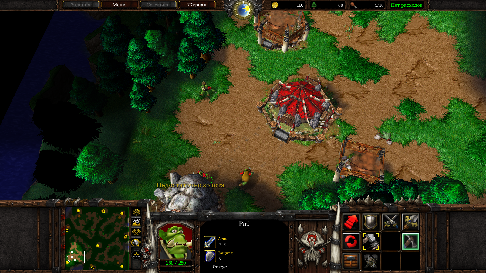

# warcraft3-worldeditor-jass
 The repository includes different files with custom Warcraft 3 TFT map

<h1>Описание репозитория</h1>
<h2>О чём здесь речь?</h2>

Есть такая уже давно почтенная игрушка в стиле real-time стратегии принятая абсолютным большинством игроков и влюбившая в себя много-много народа <b>Warcraft 3</b>. В ней главной задачей является уничтожение войск противника. Нужно выполнить оновную задачу (<i>"основной квест"</i>) игры, к примеру захватить несколько золотых рудников, источников главного ресурса — <i>золота</i>, или, допустим, прямо уничтожить главную базу противника. В Warcraft 3 можно играть за любые из 4-ёх стандартных игровых рас: Альянс, Орду, Нежить и Ночных Эльфов. Кроме того, есть возможность поиграть за другие нестандартные расы, к примеру в одиночной кампании есть расы Высших Эльфов, Тёмных Орков (Тёмная Орда), Демонов, некоторых интересных типов Оживших Скелетов и много других; а также вполне возможно сделать свою собственную расу с помощью средств внутриигрового <b>Редактора Карт</b>.

  </img>  

Так вот, у этого редактора карт есть свой встроенный язык под названием <b>Jass</b>. На нём можно программировать логику создаваемой карты, на которой и будут происходить сражения. Хотя обойтись можно без него (в редакторе карт Warcraft 3 есть также внутренний <b>GUI-редактор триггеров</b>), он даёт наибольшую гибкость в настройке многих "слоёв" вашей карты: вы можете точнейшим образом создать свою способность, анимацию или заклинание или изменить уже существующие, дать возможности юнитам (от англ. <i>"unit"</i> — юнит, боец, боевая единица, подразделение), которые невозможно сделать с помощью элементов графического интерфейса Редактора триггеров и придумать много других фишек.

Так вот, это, дорогой читатель, первый мой репозиторий тут, на Гитхабе, с небольшим проектом на Jass — кастомной картой <b>Warcraft 3: The Frozen Throne</b> и её содержимым.

Чтобы тебе было понятнее, приведу вкратце описание всех этих файлов и каталогов.

<h2>Что тут лежит?</h2>

Jass — это язык, основанный на событиях. То есть главным элементов у него являются события. Это, например, событие запуска игры, событие постройки какого-либо сооружения, событие смерти воина или завершения его обученияи готовности сражаться, или же событие нажатия по клавише клавиатуры и уйма других разных игровых событий. Эти события язык Jass и отслеживает. Здесь мы приходим к такому понятию, как <b>"триггер"</b>.

Триггер — это блок кода, который состоит из трёх частей: <i>блока событий</i>, <i>блока условий</i> и <i>блока действий</i>. Первый блок — блок событий — устанавливает конкретному триггеру, в котором он находится, сигнал, при возникновении которого триггер запустится и начнёт своё выполнение. Он сначала проверит все условия из блока условий — второго по этапу выполнения блока. Если все они истинны, то триггер пойдёт исполнять код из совего основного третьего блока — блока действий. Это тот код, который будет что-то менять в свойствах карты: устаналивать, может быть, жизни отдельным юнитам на карте, разрушать здания или поднимать уровень конкретных героев и т.д.

В этом репозитории реализованы три триггера: с названием <b>"unit dies"</b>, <b>"resurrection"</b> и <b>"delete dead unit"</b>.

  </img>  

