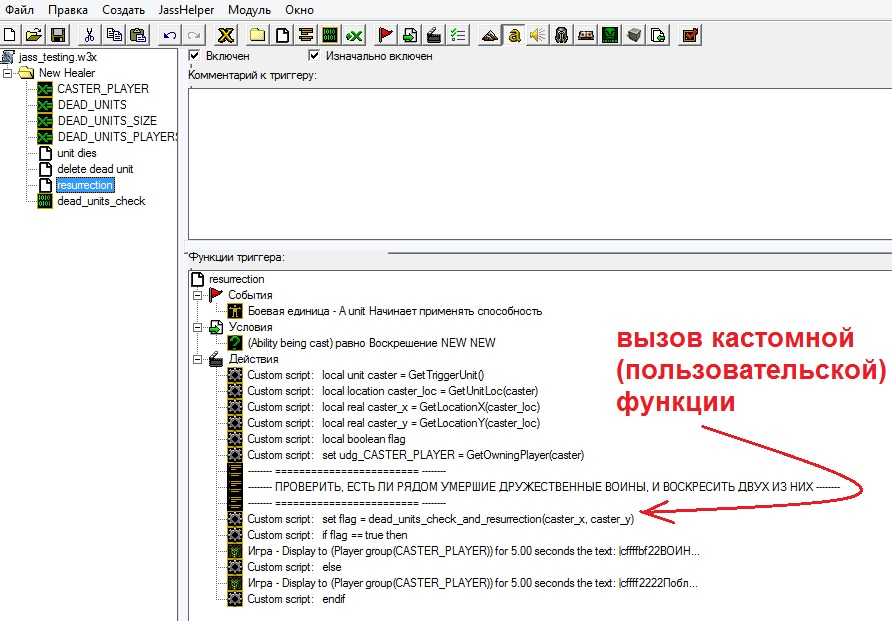

# warcraft3-worldeditor-jass
 The repository includes different files with custom Warcraft 3 TFT map

<h1>Описание репозитория</h1>
<h2>Содержание</h2>

<ul>
 <li><a href="#head1">О чём здесь речь?</a></li>
 <li><a href="#head2">Что тут лежит?</a></li>
 <li><a href="#head3">Список использованной литературы</a></li>
</ul>

<h2 name="head1" id="head1">О чём здесь речь?</h2>

Есть такая уже давно почтенная игрушка в стиле real-time стратегии принятая абсолютным большинством игроков и влюбившая в себя много-много народа <b>Warcraft 3</b>. В ней главной задачей является уничтожение войск противника. Нужно выполнить оновную задачу (<i>"основной квест"</i>) игры, к примеру захватить несколько золотых рудников, источников главного ресурса — <i>золота</i>, или, допустим, прямо уничтожить главную базу противника. В Warcraft 3 можно играть за любые из 4-ёх стандартных игровых рас: Альянс, Орду, Нежить и Ночных Эльфов. Кроме того, есть возможность поиграть за другие нестандартные расы, к примеру в одиночной кампании есть расы Высших Эльфов, Тёмных Орков (Тёмная Орда), Демонов, некоторых интересных типов Оживших Скелетов и много других; а также вполне возможно сделать свою собственную расу с помощью средств внутриигрового <b>Редактора Карт</b>.

  </img>  

Так вот, у этого редактора карт есть свой встроенный язык под названием <b>Jass</b>. На нём можно программировать логику создаваемой карты, на которой и будут происходить сражения. Хотя обойтись можно без него (в редакторе карт Warcraft 3 есть также внутренний <b>GUI-редактор триггеров</b>), он даёт наибольшую гибкость в настройке многих "слоёв" вашей карты: вы можете точнейшим образом создать свою способность, анимацию или заклинание или изменить уже существующие, дать возможности юнитам (от англ. <i>"unit"</i> — юнит, боец, боевая единица, подразделение), которые невозможно сделать с помощью элементов графического интерфейса Редактора триггеров и придумать много других фишек.

Так вот, это, дорогой читатель, первый мой репозиторий тут, на Гитхабе, с небольшим проектом на Jass — кастомной картой <b>Warcraft 3: The Frozen Throne</b> и её содержимым.

Чтобы тебе было понятнее, приведу вкратце описание всех этих файлов и каталогов.

<h2 name="head2" id="head2">Что тут лежит?</h2>

Jass — это язык, основанный на событиях. То есть главным элементов у него являются события. Это, например, событие запуска игры, событие постройки какого-либо сооружения, событие смерти воина или завершения его обученияи готовности сражаться, или же событие нажатия по клавише клавиатуры и уйма других разных игровых событий. Эти события язык Jass и отслеживает. Здесь мы приходим к такому понятию, как <b>"триггер"</b>.

Триггер — это блок кода, который состоит из трёх частей: <i>блока событий</i>, <i>блока условий</i> и <i>блока действий</i>. Первый блок — блок событий — устанавливает конкретному триггеру (в котором он находится) <i>сигнал</i>, при возникновении которого триггер запустится и начнёт своё выполнение. Он сначала проверит все <i>условия</i> из блока условий — второго по этапу выполнения блока. Если все они истинны, то триггер пойдёт исполнять код из совего основного третьего блока — блока <i>действий</i>. Это тот код, который будет что-то менять в свойствах карты: устаналивать, может быть, жизни отдельным юнитам на карте, разрушать здания или поднимать уровень конкретных героев и т.д.

В этом репозитории реализованы три триггера: с названием <b>"unit dies"</b>, <b>"resurrection"</b> и <b>"delete dead unit"</b>.

Цель состоит в том, чтобы создать <b>новую способность</b> для выбранного юнита (у нас этот юнит — с моделью стандартного "целителя"), которая будет <b>воскрешать</b> погибших недавно солдат в бою. Причём, воскрешает эта способность <b>не более двух</b> юнитов. Настройка такой способности производится почти полностью на Jass (отчасти с использованием графического интерфейса Редактора триггеров: для ускорения написания программы).

  </img>  <b>Скриншот 1 — Внешний вид Редактора карт Warcraft 3 TFT</b>  

 Триггер "unit dies" имеет в качестве события строку <code>"Unit умирает"</code> (см. <a href="#screen2">скриншот 2</a> ниже). Это значит, что он будет ждать, пока кто-нибудь на карте не умрёт. После чего он сработает и перейдёт в следующий блок — где располагается список условий (как событий, так и условий может быть сразу несколько, а не только по одному на триггер). Условий у этого триггера нет. Значит, можно сразу выполнять блок действий.
 

  <table align="center"><tr><td align="center"></img>  <b>Скриншот 2 — Содержимое триггера "unit dies"</b></td></tr></table>  

В этом блоке действий ссылка (называется ещё <i>указателем</i> в языке Си) на умершего юнита сохраняется в локальную переменную (англ. <i>"local"</i>) (локальную относительно этого триггера) — <code>dead_unit</code>. Затем эта ссылка копируется в массив умерших юнитов <code>DEAD_UNITS</code> (он имеет соответствующий тип: <code>unit array</code>). Также сведения об игроке падшего воина сохраняются в другой массив типа <code>player array</code>: <code>DEAD_UNITS_PLAYERS</code>. Счётчиком элементов этих двух массивов является переменная <code>DEAD_UNITS_SIZE</code>. Все эти три переменные <i>глобальные</i>. Это значит, что к ним, в отличие от локальных переменных, можно обратиться из любого места программы Jass: из другого триггера или другой функции (к локальной можно обратиться только в том триггере (или функции), где она создавалась).

При обращении к глобальным переменным из Jass-кода ставится префикс <code>udg_</code> (Universally Defined Global — универсально объявленная глобальная переменная). Так принято в синтаксисе этого Варкрафта. А создаются глобальные переменные не в Jass-коде, а прямо в графическом редакторе триггеров с помощью соответствующей иконки в верхнем меню (<i>CTRL+B</i>). Они покажутся в самом верху (см. <a href="#screen3">скриншот 3</a> ниже).

  <table align="center"><tr><td align="center"></img>  <b>Скриншот 3 — Четыре глобальных переменных карты этого репозитория</b></td></tr></table>  

Вконце, последним действием, вызывается второй триггер с именем "delete dead unit", который не имеет ни событий, ни условий, а только действия. Этот триггер через некоторое время (<b>через 8 секунд</b>, которые записаны в игровую неизменную константу <code>bj_CORPSE_MAX_DEATH_TIME</code>) окончательно удаляет с карты погибшего солдата (вместо которого позже, в функции <code>dead_units_check_and_resurrection()</code> (<code>dead_units_check()</code>), создастся <b>новый</b> юнит с полным запасом здоровья и маны).

Но самым главным триггером в этом сценарии можно считать триггер <b>"resurrection"</b> (см. <a href="#screen4">скриншот 4</a> чуть ниже). Он вызывается, когда колдун с обсуждаемой новой способностью "Воскрешения" начинает применять это заклинание (у нас в контексте <i>заклинание = способность</i>). Он также имеет одно условие (вызвана ли способность именно "Воскрешение", а не какая-то другая). Если вызвана наша способность, то триггер начинает сохранять ссылку на юнита-колдуна, вызвавшего это заклинание (локальная переменная <code>caster</code>); сохранять координаты его нахождения для последующего поиска трупов бойцов в заданном радиусе, неподалёку от этого кастера (колдуна); этим триггером изменяется также ещё одна глобальная перменная (четвёртая) <code>CASTER_PLAYER</code>, которая хранит номер игрока, владеющего колдуном (к слову, игроков на одной карте всего может быть максимум 24, в этой версии Warcraft).

А дальше уже вызывается функция <code>dead_units_check_and_resurrection()</code>, которая и оживит умерших рядом с колдуном воинов (сражающихся за него же):

 
  <code>set flag = dead_units_check_and_resurrection(caster_x, caster_y)</code>  

  <table align="center"><tr><td align="center"></img>  <b>Скриншот 4 — Содержимое, можно сказать, центрального триггера всего проекта — "resurrection"</b></td></tr></table>  

Код функции <code>dead_units_check_and_resurrection()</code> лежит в репозитории по пути <b>triggers/dead_units_check.txt</b> с подробными комментариями почти к каждой строке.

<h2>Тестирование способности</h2>

  <table align="center"><tr><td align="center"></img>  <b>Гиф 1 — Тестирование карты проекта</b></td></tr></table>  

<h2 name="head3" id="head3">Список использованной литературы</h2>

<ol>
 <li>JASS Manual // JASS Tools URL: http://jass.sourceforge.net/doc/ (дата обращения: 03.04.2022).</li>
 <li>JASS: Курс молодого бойца // xgm.guru URL: https://xgm.guru/p/wc3/jass-crash-course (дата обращения: 03.04.2022).</li>
 <li>Осваиваем jass (0-1) // xgm.guru URL: https://xgm.guru/p/wc3/jassintroduction (дата обращения: 03.04.2022).</li>
 </ol>

